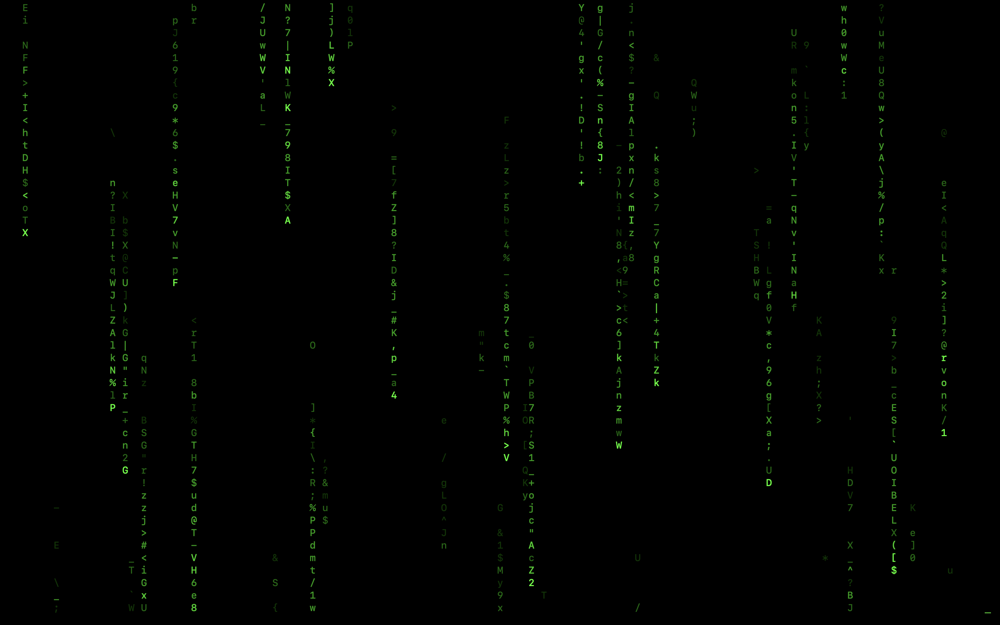

# matrix-style-terminal

### A program running in a UNIX terminal that stylizes the screen as a Matrix movie

The program is a modified version of the [**Jacob Sorber**](https://www.youtube.com/watch?v=K8dCh3ZMLN8) program using C++ language syntax and mechanisms instead of pure C.

